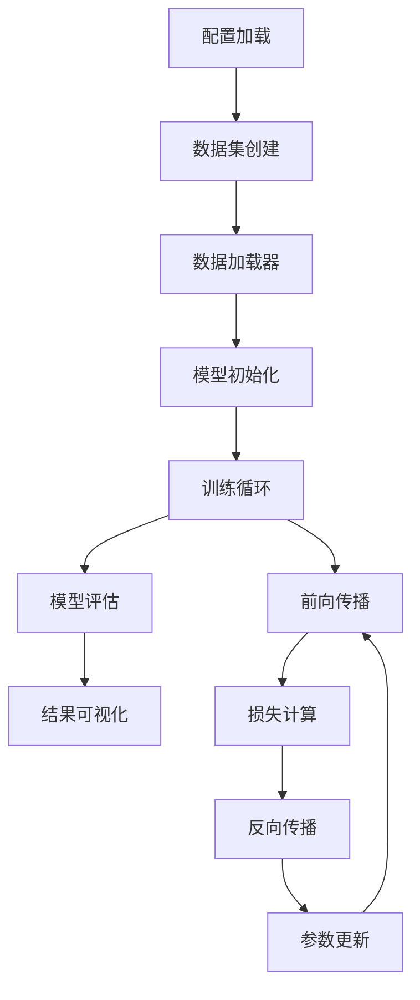
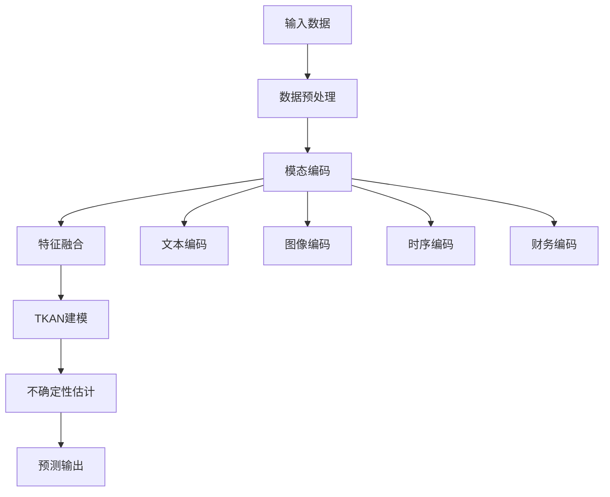

# 📚 模块原理与使用指南

本文档详细介绍HS300多模态股票预测系统中每个核心模块的原理、作用和使用方法。

## 📋 目录

1. [数据处理模块](#数据处理模块)
2. [模型架构模块](#模型架构模块)
3. [工具函数模块](#工具函数模块)
4. [配置管理模块](#配置管理模块)

---

## 数据处理模块

### 📊 data/dataset.py - 数据集类

#### 核心原理
`FinMultiTimeDataset` 是整个系统的数据核心，负责加载和预处理四种模态的数据：

```python
# 数据流程
原始数据 → 数据加载 → 特征提取 → 数据对齐 → 滑动窗口 → 训练样本
```

#### 主要功能

1. **多模态数据加载**
   - 时序数据：从CSV文件加载OHLCV数据
   - 图像数据：从PNG文件提取CNN特征
   - 文本数据：从JSONL文件加载新闻情感分数
   - 财务数据：从JSONL文件加载基本面指标

2. **数据对齐和同步**
   - 按日期对齐不同模态的数据
   - 处理缺失数据和异常值
   - 确保时间序列的连续性

3. **特征工程**
   - 时序特征：价格变化率、技术指标
   - 图像特征：CNN提取的64维特征向量
   - 文本特征：情感分析得分
   - 财务特征：标准化的基本面指标

#### 使用示例

```python
from data.dataset import FinMultiTimeDataset

# 创建数据集
dataset = FinMultiTimeDataset(
    data_dir="../Finmultime",
    market="HS300",
    stocks=None,  # 加载所有可用股票
    start_date="2019-01-01",
    end_date="2023-12-31",
    seq_length=30,  # 30天历史数据
    pred_horizon=1  # 预测1天
)

print(f"数据集大小: {len(dataset)}")
print(f"输入维度: {dataset[0]['x'].shape}")
print(f"输出维度: {dataset[0]['y'].shape}")
```

#### 关键参数说明

- `seq_length`: 历史序列长度，决定模型能看到多长的历史
- `pred_horizon`: 预测时间跨度，通常设为1（预测下一天）
- `use_cnn_features`: 是否使用CNN提取图像特征
- `cnn_feature_dim`: CNN特征维度，默认64

### 🔄 data/dataloader.py - 数据加载器

#### 核心原理
提供高效的批量数据加载和预处理管道：

```python
# 数据加载流程
数据集 → 批量采样 → 数据增强 → 张量转换 → GPU传输
```

#### 主要功能

1. **批量数据加载**
   - 支持多进程并行加载
   - 内存优化的数据缓存
   - 动态批量大小调整

2. **数据增强**
   - 时序数据：添加噪声、时间扭曲
   - 图像数据：旋转、缩放、颜色变换
   - 文本数据：情感分数扰动

3. **训练/验证分割**
   - 时间序列分割（避免数据泄露）
   - 股票级别分割
   - 交叉验证支持

#### 使用示例

```python
from data.dataloader import create_dataloaders

# 创建数据加载器
train_loader, val_loader, test_loader = create_dataloaders(
    dataset=dataset,
    batch_size=32,
    train_ratio=0.7,
    val_ratio=0.2,
    num_workers=4
)

# 训练循环
for batch in train_loader:
    x, y = batch['x'], batch['y']
    # 模型训练...
```

---

## 模型架构模块

### 🧠 models/tkan_model.py - TKAN核心模型

#### 核心原理
TKAN (Temporal Kolmogorov-Arnold Networks) 是本系统的核心时序建模组件：

```
输入序列 → TKAN层1 → TKAN层2 → ... → 输出层 → 预测结果
    ↓         ↓         ↓              ↓         ↓
  多模态    时序建模   非线性变换      特征融合   股价预测
```

#### TKAN原理详解

1. **Kolmogorov-Arnold表示定理**
   - 任何多变量连续函数都可以表示为单变量函数的组合
   - TKAN将此理论应用于时序数据建模

2. **时序注意力机制**
   ```python
   # 注意力计算
   Q = XW_q  # 查询矩阵
   K = XW_k  # 键矩阵
   V = XW_v  # 值矩阵
   
   Attention = softmax(QK^T / √d_k)V
   ```

3. **非线性激活函数学习**
   - 传统神经网络：固定激活函数（ReLU、Sigmoid等）
   - TKAN：学习最优的激活函数形状

#### 模型结构

```python
class MultimodalTKANModel(nn.Module):
    def __init__(self, input_size, hidden_size, output_size, num_layers):
        # TKAN层堆叠
        self.tkan_layers = nn.ModuleList([
            TKANLayer(input_size if i==0 else hidden_size, hidden_size)
            for i in range(num_layers)
        ])
        
        # 输出层
        self.fc_out = nn.Linear(hidden_size, output_size)
```

#### 使用示例

```python
from models.tkan_model import MultimodalTKANModel

# 创建模型
model = MultimodalTKANModel(
    input_size=77,      # 6+64+1+6 (时序+图像+文本+财务)
    hidden_size=128,    # 隐藏层维度
    output_size=1,      # 预测1天收益率
    num_layers=2        # TKAN层数
)

# 前向传播
x = torch.randn(32, 30, 77)  # (batch, seq_len, features)
predictions = model(x)        # (batch, 1)
```

### 🔗 models/advanced_model.py - 高级多模态模型

#### 核心原理
整合所有先进技术的端到端模型：

```
各模态输入 → 独立编码 → 注意力融合 → 多尺度TKAN → 不确定性估计 → 预测输出
     ↓          ↓          ↓           ↓            ↓           ↓
  时序+图像   特征提取   跨模态交互   时序建模     置信区间    股价+方差
  文本+财务   维度统一   权重分配    多尺度      风险量化    涨跌概率
```

#### 主要组件

1. **模态编码器**
   - 文本编码器：BERT或简化情感编码器
   - 图像编码器：预训练CNN或自定义CNN
   - 时序编码器：线性变换和归一化
   - 财务编码器：特征选择和标准化

2. **注意力融合模块**
   ```python
   # 跨模态注意力
   attention_weights = softmax(Q_text @ K_image^T)
   fused_features = attention_weights @ V_image
   ```

3. **多尺度TKAN**
   - 短期尺度：5-10天模式
   - 中期尺度：20-30天周期
   - 长期尺度：全序列依赖

4. **不确定性估计**
   ```python
   # 高斯负对数似然损失
   mean, log_var = model(x)
   loss = 0.5 * (log_var + (y - mean)^2 / exp(log_var))
   ```

#### 使用示例

```python
from models.advanced_model import AdvancedMultimodalStockPredictor

# 创建高级模型
model = AdvancedMultimodalStockPredictor(
    time_series_dim=6,
    text_dim=128,
    image_dim=64,
    table_dim=6,
    use_bert=True,
    use_pretrained_image=True,
    estimate_uncertainty=True
)

# 前向传播
output = model(batch_data)
mean_pred = output['mean']      # 预测均值
var_pred = output['variance']   # 预测方差
confidence = output['confidence']  # 置信区间
```

### 📝 models/text_encoder.py - 文本编码器

#### 核心原理
将新闻文本转换为数值特征向量：

```
原始文本 → 分词 → BERT编码 → 池化 → 时序聚合 → 文本特征向量
   ↓        ↓       ↓        ↓        ↓          ↓
新闻标题   Token   语义表示  句子向量  多新闻融合  128维特征
```

#### 两种编码方式

1. **BERT编码器**（高级版）
   ```python
   # 使用预训练BERT模型
   from transformers import BertModel, BertTokenizer
   
   tokenizer = BertTokenizer.from_pretrained('bert-base-chinese')
   bert_model = BertModel.from_pretrained('bert-base-chinese')
   ```

2. **简化编码器**（基础版）
   ```python
   # 将1维情感分数扩展为128维特征
   features = self.feature_expansion(sentiment_score)
   ```

#### 关键技术

1. **时序聚合**
   - 处理每天多条新闻
   - LSTM聚合时序信息
   - 注意力权重分配

2. **情感分析增强**
   - 金融词典情感分析
   - 上下文语义理解
   - 情感强度量化

#### 使用示例

```python
from models.text_encoder import create_text_encoder

# 创建文本编码器
text_encoder = create_text_encoder(
    use_bert=True,      # 使用BERT（如果可用）
    output_dim=128,     # 输出维度
    max_length=128      # 最大文本长度
)

# 编码文本
texts = ["股市上涨", "经济增长放缓"]
features = text_encoder(texts)  # (batch, seq_len, 128)
```

### 🖼️ models/image_encoder.py - 图像编码器

#### 核心原理
从K线图中提取技术形态特征：

```
K线图像 → CNN特征提取 → 全局池化 → 特征压缩 → 图像特征向量
   ↓          ↓           ↓         ↓          ↓
PNG文件   卷积+池化    空间聚合   维度降低    64维特征
```

#### 两种实现方式

1. **基础CNN编码器**
   ```python
   # 自定义CNN架构
   self.cnn = nn.Sequential(
       nn.Conv2d(1, 32, 3, padding=1),
       nn.ReLU(),
       nn.MaxPool2d(2),
       # ... 更多层
   )
   ```

2. **高级预训练编码器**
   ```python
   # 使用预训练模型
   import timm
   self.backbone = timm.create_model(
       'efficientnet_b0',
       pretrained=True,
       in_chans=1,
       num_classes=0
   )
   ```

#### 技术特色

1. **K线模式识别**
   - 头肩顶、双底等经典形态
   - 支撑阻力位识别
   - 趋势线检测

2. **技术指标提取**
   - 移动平均线形态
   - 成交量模式
   - 波动率特征

#### 使用示例

```python
from models.image_encoder import create_image_encoder

# 创建图像编码器
image_encoder = create_image_encoder(
    feature_dim=64,
    use_pretrained=True,
    use_ensemble=False
)

# 编码图像
images = torch.randn(32, 1, 224, 224)  # 灰度K线图
features = image_encoder(images)        # (32, 64)
```

### 🔀 models/fusion.py - 多模态融合

#### 核心原理
智能融合不同模态的信息：

```
各模态特征 → 注意力计算 → 权重分配 → 特征融合 → 融合表示
     ↓          ↓          ↓         ↓         ↓
时序+图像    跨模态交互   动态权重   加权求和   统一特征
文本+财务    相关性计算   重要性     信息整合   256维向量
```

#### 融合策略

1. **跨模态注意力**
   ```python
   # 计算模态间的注意力权重
   attention_scores = torch.matmul(Q_modal1, K_modal2.transpose(-2, -1))
   attention_weights = F.softmax(attention_scores / sqrt(d_k), dim=-1)
   fused_features = torch.matmul(attention_weights, V_modal2)
   ```

2. **门控融合机制**
   ```python
   # 学习每个模态的重要性
   gate_text = torch.sigmoid(self.gate_text(text_features))
   gate_image = torch.sigmoid(self.gate_image(image_features))
   
   fused = gate_text * text_features + gate_image * image_features
   ```

3. **自适应权重分配**
   - 根据数据质量动态调整权重
   - 处理模态缺失情况
   - 避免某个模态主导

#### 使用示例

```python
from models.fusion import AdvancedMultimodalFusion

# 创建融合模块
fusion = AdvancedMultimodalFusion(
    input_dims=[6, 128, 64, 6],  # 各模态维度
    embed_dim=64,                # 嵌入维度
    num_heads=4,                 # 注意力头数
    output_dim=256               # 输出维度
)

# 融合多模态特征
modality_features = {
    'time_series': time_features,
    'text': text_features,
    'image': image_features,
    'table': table_features
}

fused_features = fusion(modality_features)  # (batch, seq_len, 256)
```

---

## 工具函数模块

### 📊 utils/metrics.py - 评估指标

#### 核心原理
提供全面的模型性能评估指标：

```
预测结果 → 基础指标 → 金融指标 → 风险指标 → 综合评估
   ↓         ↓         ↓         ↓         ↓
真实值    MSE/MAE    夏普比率   最大回撤   模型质量
预测值    R²/RMSE    索提诺比   胜率      投资价值
```

#### 指标分类

1. **基础回归指标**
   ```python
   # 均方误差
   mse = torch.mean((y_true - y_pred) ** 2)
   
   # 决定系数
   ss_res = torch.sum((y_true - y_pred) ** 2)
   ss_tot = torch.sum((y_true - torch.mean(y_true)) ** 2)
   r2 = 1 - ss_res / ss_tot
   ```

2. **金融专用指标**
   ```python
   # 夏普比率
   returns = y_pred  # 预测收益率
   sharpe_ratio = torch.mean(returns) / torch.std(returns)
   
   # 方向准确率
   direction_accuracy = torch.mean(
       (torch.sign(y_true) == torch.sign(y_pred)).float()
   )
   ```

#### 使用示例

```python
from utils.metrics import calculate_comprehensive_metrics

# 计算所有指标
y_true = torch.randn(1000, 24)  # 真实收益率
y_pred = torch.randn(1000, 24)  # 预测收益率

metrics = calculate_comprehensive_metrics(y_true, y_pred)

print(f"R²: {metrics['r2']:.4f}")
print(f"夏普比率: {metrics['sharpe_ratio']:.4f}")
print(f"方向准确率: {metrics['direction_accuracy']:.4f}")
```

### 💰 utils/financial_metrics.py - 金融指标

#### 核心原理
专门针对金融时序数据的评估指标：

```
收益序列 → 风险计算 → 收益分析 → 回撤分析 → 交易统计
   ↓         ↓         ↓         ↓         ↓
预测收益   波动率    累计收益   最大回撤   胜率统计
真实收益   VaR      年化收益   回撤持续   盈亏比
```

#### 关键指标

1. **风险调整收益**
   ```python
   # 夏普比率：超额收益/波动率
   sharpe = (mean_return - risk_free_rate) / std_return
   
   # 索提诺比率：超额收益/下行波动率
   downside_std = std(returns[returns < 0])
   sortino = (mean_return - risk_free_rate) / downside_std
   ```

2. **回撤分析**
   ```python
   # 最大回撤
   cumulative_returns = (1 + returns).cumprod()
   running_max = cumulative_returns.cummax()
   drawdown = (cumulative_returns - running_max) / running_max
   max_drawdown = drawdown.min()
   ```

3. **交易统计**
   ```python
   # 胜率
   win_rate = (returns > 0).mean()
   
   # 盈亏比
   avg_win = returns[returns > 0].mean()
   avg_loss = returns[returns < 0].mean()
   profit_loss_ratio = avg_win / abs(avg_loss)
   ```

### 🎨 utils/visualization.py - 可视化工具

#### 核心原理
提供丰富的数据和结果可视化功能：

```
数据/结果 → 图表生成 → 样式美化 → 交互功能 → 可视化输出
    ↓         ↓         ↓         ↓         ↓
训练历史   时序图表   颜色主题   缩放平移   PNG/HTML
预测结果   散点图    图例标注   工具提示   保存分享
```

#### 可视化类型

1. **训练过程可视化**
   ```python
   # 损失曲线
   plt.plot(train_losses, label='Training Loss')
   plt.plot(val_losses, label='Validation Loss')
   
   # 学习率变化
   plt.plot(learning_rates, label='Learning Rate')
   ```

2. **预测结果可视化**
   ```python
   # 预测vs真实值
   plt.scatter(y_true, y_pred, alpha=0.6)
   plt.plot([y_true.min(), y_true.max()], 
            [y_true.min(), y_true.max()], 'r--')
   
   # 时序预测图
   plt.plot(dates, y_true, label='Actual', linewidth=2)
   plt.plot(dates, y_pred, label='Predicted', linewidth=2)
   ```

3. **不确定性可视化**
   ```python
   # 置信区间
   plt.fill_between(dates, 
                    y_pred - 1.96*std_pred,
                    y_pred + 1.96*std_pred,
                    alpha=0.3, label='95% Confidence')
   ```

---

## 配置管理模块

### ⚙️ configs/config.py - 基础配置

#### 核心原理
集中管理所有系统参数：

```
配置文件 → 参数解析 → 类型检查 → 默认值 → 配置对象
   ↓         ↓         ↓         ↓        ↓
YAML/JSON  字典转换   数据验证   缺失补全  Python类
```

#### 配置结构

```python
@dataclass
class Config:
    data: DataConfig        # 数据相关配置
    model: ModelConfig      # 模型相关配置
    train: TrainConfig      # 训练相关配置
```

#### 使用示例

```python
from configs.config import Config

# 加载默认配置
config = Config()

# 修改配置
config.train.epochs = 50
config.train.batch_size = 64
config.model.hidden_size = 256

# 使用配置
model = create_model(config.model)
dataset = create_dataset(config.data)
```

### 🚀 configs/advanced_config.py - 高级配置

#### 核心原理
为高级功能提供专门的配置管理：

```
高级配置 → 功能开关 → 资源分配 → 性能优化 → 高级模型
   ↓         ↓         ↓         ↓         ↓
BERT开关   GPU内存    批量大小   混合精度   注意力层数
预训练模型  多进程     学习率     梯度累积   融合维度
```

#### 配置预设

1. **快速测试配置**
   ```python
   def get_fast_test_config():
       config = AdvancedConfig()
       config.data.stocks = 3
       config.train.epochs = 3
       config.model.use_bert = False
       return config
   ```

2. **生产环境配置**
   ```python
   def get_production_config():
       config = AdvancedConfig()
       config.model.use_bert = True
       config.model.use_pretrained_image = True
       config.train.mixed_precision = True
       return config
   ```

#### 使用示例

```python
from configs.advanced_config import get_advanced_config

# 加载高级配置
config = get_advanced_config()

# 创建高级模型
model = AdvancedMultimodalStockPredictor(
    **config.model.__dict__
)
```

---

## 🎯 模块协作流程

### 完整的训练流程



### 预测流程



---

## 📝 最佳实践

### 1. 模型选择建议

- **资源受限**：使用基础配置，关闭BERT和预训练模型
- **追求性能**：使用高级配置，开启所有功能
- **快速验证**：使用快速测试配置，少量数据和轮次

### 2. 参数调优建议

- **学习率**：从0.001开始，根据损失曲线调整
- **批量大小**：根据GPU内存调整，通常32-128
- **序列长度**：30-60天历史数据效果较好
- **隐藏维度**：128-512，根据数据复杂度调整

### 3. 性能优化建议

- **数据并行**：使用多GPU训练
- **混合精度**：开启FP16训练
- **梯度累积**：内存不足时使用
- **模型剪枝**：部署时压缩模型

---

**文档版本**: 2.0.0  
**最后更新**: 2025-10-08  
**维护者**: HS300项目团队
